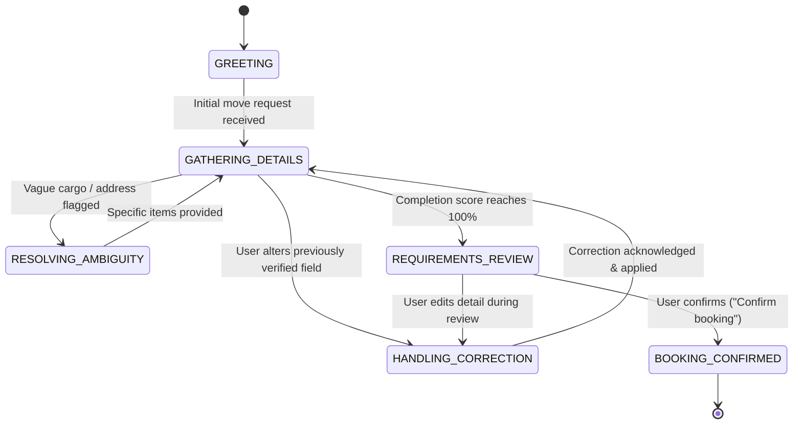

# Architecture & Engineering Design: Porter AI Voice Booking Agent

This document details the architectural principles, state management strategies, negative-path resilience models, and security guarantees governing the Porter AI Voice Booking Agent.

---

## 1. Architectural Philosophy

Most conversational booking agents fail in production because they treat dialogue management and business logic as an unconstrained single-pass prompting problem. This leads to:
1. **Hallucinatory state changes**: The agent "forgets" earlier pickup addresses when the user mentions a dropoff address.
2. **Form-like interrogations**: Rigid slot-filling agents sound robotic, asking for fields one-by-one regardless of what was already implied.
3. **Inability to recover from contradictions**: When a user changes an already supplied field, naive agents get stuck or store conflicting facts.
4. **Dangerous business violations**: Booking moves in the past, dispatching 2-wheelers for king-size beds, or accepting hazardous cargo.

### The Decoupled Dual-Pass Architecture

To solve these failure modes, our system strictly separates **perception** (speech & entity extraction), **deterministic domain governance** (validation, sizing, contradiction audit), and **conversational response synthesis**:

```
[ User Speech / Audio Stream ]
            │
            ▼
[ Client VAD & Web Speech / Whisper API ]
            │
            ▼ (Raw Utterance)
┌─────────────────────────────────────────────────────────────┐
│ Pass 1: Extractor Agent (LLM with Strict JSON Schema)        │
│ • Detects newly mentioned entities & relative dates         │
│ • Flags contradictions & explicit slot overrides            │
│ • Flags ambiguous inventory phrases ("a few things")        │
│ • Detects hazardous cargo & off-topic questions             │
└─────────────────────────────────────────────────────────────┘
            │
            ▼ (ExtractorDelta)
┌─────────────────────────────────────────────────────────────┐
│ Deterministic State Reducer & Business Guardrails (Code)    │
│ • Past-date blocker (strictly checked against Date.now())    │
│ • Rejection of prohibited goods (petrol, animals, cylinder) │
│ • Location phonetic repair (Koramangala, Whitefield, etc.)  │
│ • Volume & Weight calculation from Item Catalog             │
│ • Vehicle recommendation (2-Wheeler -> Tata Ace -> 14ft)   │
│ • Helper crew requirement based on Floor & Elevator         │
│ • State mutation audit logging (StateAuditEntry[])          │
│ • Phase progression & Completion % evaluator                │
└─────────────────────────────────────────────────────────────┘
            │
            ▼ (Validated & Audited BookingState)
┌─────────────────────────────────────────────────────────────┐
│ Pass 2: Conversational Synthesizer Agent                    │
│ • Persona: Friendly, efficient Porter logistics dispatcher  │
│ • Never asks for verified, already-known fields             │
│ • Acknowledges corrections first                            │
│ • Bundles missing information into natural dialogue         │
│ • Transitions to structured verbal summary upon 100% score  │
└─────────────────────────────────────────────────────────────┘
            │
            ▼ (Text Response)
[ Speech Synthesis (Barge-In Capable Web Speech / Neural TTS) ]
```

---

## 2. Conversation State Machine & Lifecycle

The booking agent operates as a finite state machine with 7 explicit phases:



### Phase Transition Rules

| Phase | Entry Condition | Primary Conversational Objective |
| :--- | :--- | :--- |
| **GREETING** | Initial turn with no locations or cargo. | Welcomes user to Porter and inquires about origin and destination. |
| **GATHERING_DETAILS** | 1 or more fields known, but mandatory fields remain missing. | Gathers remaining details (floor access, inventory, schedule) in conversational bundles. |
| **RESOLVING_AMBIGUITY** | `inventory.isVague === true` or ambiguous phrasing detected. | Clarifies cargo composition to recommend the correct vehicle. |
| **HANDLING_CORRECTION** | An existing verified field is overwritten by the user. | Explicitly acknowledges the change before proceeding. |
| **REQUIREMENTS_REVIEW** | Completion score = 100% (pickup, dropoff, floor access, date, items verified). | Recites the complete structured summary and asks for confirmation. |
| **BOOKING_CONFIRMED** | User verbally affirms or clicks Confirm. | Issues booking reference ID (`#PTR-9021`) and finalizes transaction. |

---

## 3. Negative Paths & Edge Cases: Architecture Matrix

The technical assessment heavily weights negative paths. Here is how each failure mode is handled:

### 3.1 Ambiguity ("Vague input instead of guessing")
- **Trigger**: User says *"I need to move a few things from Koramangala to Whitefield tomorrow evening."*
- **Mechanism**: The Extractor flags `isVagueInventory: true`. The State Reducer marks `inventory.isVague = true` and lowers completion score.
- **Agent Behavior**: The agent never assigns a truck prematurely. Instead, it asks:
  > *"I've noted Koramangala to Whitefield for tomorrow evening. Could you specify roughly what items you're moving — for example, any large furniture like a bed or fridge, or mostly boxed cartons? That helps me dispatch the right vehicle."*

### 3.2 Corrections & Contradictions ("Detecting, confirming, propagating")
- **Trigger**: Turn 1: *"Pickup is Koramangala."* $\rightarrow$ Turn 3: *"Actually wait, don't pick up from Koramangala, change it to Indiranagar 100ft road."*
- **Mechanism**: The State Reducer compares the existing verified `pickup.normalizedLocation` with the new delta. It creates an immutable audit record in `metadata.revisionHistory`:
  ```json
  {
    "field": "pickup.location",
    "oldValue": "Koramangala",
    "newValue": "Indiranagar 100ft road",
    "reason": "USER_CORRECTION",
    "turnIndex": 3
  }
  ```
- **Agent Behavior**: Explicit verbal acknowledgment:
  > *"Got it! Updated your pickup location from Koramangala to Indiranagar 100ft Road. Dropoff remains Whitefield."*

### 3.3 Speech-to-Text Errors & Indian Phonetic Recovery
- **Trigger**: Audio transcription captures *"Core Mangala"*, *"White Field"*, or *"H S R layout sect 1"*.
- **Mechanism**: `normalizeLocation()` runs pre-compiled phonetic regular expressions mapping known misspellings to canonical Bengaluru localities.
- **Result**: `"Core Mangala 4th block"` $\rightarrow$ `"Koramangala 4th block"`.

### 3.4 Out-of-Scope or Impossible Inputs
1. **Past Dates**:
   - `parseRelativeDate("yesterday")` returns `{ isPast: true }`.
   - The State Reducer sets `schedule.isPastDate = true`, sets `isValid = false`, and records a system warning.
   - Agent response: *"That date has already passed. Would you like to schedule your move for today or tomorrow?"*
2. **Prohibited / Hazardous Cargo**:
   - `checkHazardousItem()` inspects items against restricted substances (gas cylinders, petrol, chemicals, live animals, cash).
   - Prohibited items are blocked from entering the active inventory.
   - Agent response: *"For safety and compliance reasons, Porter cannot transport gas cylinders or live animals. Would you like to proceed with just your household furniture?"*
3. **Identical Pickup and Dropoff**:
   - `validateRoute()` checks `pickup === dropoff`. If identical, flags an invalid route error.

### 3.5 Silence, Barge-in, and Interruption
- **Barge-In**: When the agent speaks via TTS, any new user voice detection or button press triggers `window.speechSynthesis.cancel()` immediately.
- **Silence Detection**: Client audio energy monitor starts a 7-second timer when microphone is active. If no speech is received:
  > *"I didn't catch that. Are you still looking to book a move in Bengaluru?"*

### 3.6 Off-Topic Detours
- **Trigger**: User asks *"What's the weather like in Bangalore right now?"*
- **Mechanism**: Extractor flags `isOffTopic: true`.
- **Agent Behavior**: 1 polite sentence deflecting + smooth bridge back:
  > *"It's quite pleasant in Bengaluru today! Coming back to your move, what floor is the dropoff apartment on, and does it have a lift?"*

---

## 4. Logistics & Physical Sizing Engine

The system contains a deterministic physical sizing matrix (`KNOWN_ITEM_CATALOG`) mapping common household items to cubic feet and kilograms:

| Cargo Sizing Tier | Cubic Volume | Weight Limit | Fleet Assigned |
| :--- | :--- | :--- | :--- |
| **Small Parcels** | $\le 25\text{ cu ft}$ | $\le 30\text{ kg}$ | 2-Wheeler |
| **Mini Load** | $\le 60\text{ cu ft}$ | $\le 150\text{ kg}$ | 3-Wheeler Champion |
| **1 BHK / Studio** | $\le 240\text{ cu ft}$ | $\le 850\text{ kg}$ | Tata Ace (Chota Hathi) |
| **2 BHK Move** | $\le 400\text{ cu ft}$ | $\le 1,250\text{ kg}$ | 8ft Pickup Truck |
| **3 BHK+ / Large** | $\le 600\text{ cu ft}$ | $\le 2,500\text{ kg}$ | 14ft Canter Truck |
| **Overload** | $> 600\text{ cu ft}$ | $> 2,500\text{ kg}$ | UNSERVICEABLE_OVERLOAD |

### Helper Crew Allocation
- Floor $\ge 2$ without elevator at either pickup or dropoff + heavy items (bed, sofa, wardrobe) $\rightarrow$ **2 Helpers** automatically allocated.
- Ground floor or elevator available $\rightarrow$ **Driver assist** / 1 helper.

---

## 5. Security & Secret Isolation

1. **Zero Client Leakage**:
   - No API keys (`GROQ_API_KEY`, `OPENAI_API_KEY`) are present in client-side bundles or `NEXT_PUBLIC_*` variables.
   - All AI calls occur inside Next.js serverless route handlers (`/api/chat`, `/api/transcribe`).
2. **Deterministic Offline Fallback**:
   - In the event that third-party LLM APIs face downtime or no API key is supplied, the server seamlessly falls back to the deterministic local rule-based extractor and synthesizer, ensuring uninterrupted evaluation.
